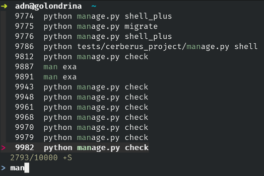

# Living in the shell - My mouseless  workspace

A couple of years ago I started using Vim, at the time I was a thinking about
how much I was relying on the autocomplete feature of IDEs to write code, it
was like going on automatic, type a few words, pressed TAB, select and repeat.
It felt like I was being lazy with my mind, then one day I decided to give Vim
a try and I've never used other editors/IDEs since.

Using Vim made me realize just how annoying the mouse was. Every time I had
to move my hand away from the keyword it felt wrong, like a disruption, that's
when my mouseless age began. In this posts, I will show some of the tools I
use on daily basis.

Here's my [dotfiles configuration](https://github.com/alejandrodnm/dotfiles)
if you want to take a look.

## Mapping CapsLock to Ctrl

This is such a simple thing, trust me and just do it, you won't believe how
right it feels once you start using it.

I use Fedora with Gnome so I just have to open the Tweaks application then
Keyword & Mouse -> Aditional Layout Options -> Caps Lock behavior -> Caps Lock
is also Ctrl.


## Zsh

https://github.com/robbyrussell/oh-my-zsh/wiki/Installing-ZSH

https://github.com/robbyrussell/oh-my-zsh

https://github.com/zsh-users/zsh-syntax-highlighting/blob/master/INSTALL.md

Zsh is a UNIX shell and oh-my-zsh a framework for managing its configuration.
It's like bash on steroids.

I don't use many zsh plugins, besides syntax highlighting, the ones
currently enabled in my profile are:

```
plugins=(git mix-fast vi-mode)
```

You can read more on the plugins [here](https://github.com/robbyrussell/oh-my-zsh/wiki/Plugins).

Here's how it looks the syntax highlight, the `[NORMAL]` tag that appears on
the right it's letting me know that I'm in vim normal mode.


## Tmux

https://github.com/tmux/tmux

From man tmux

> tmux is a terminal multiplexer: it enables a number of terminals to be
> created, accessed, and controlled from a single screen. tmux may be detached
> from a screen and continue running in the background, then later reattached.

Tmux allows you, among other things, to split the terminal screen into panes,
create new tabs (windows), it can be used for peer programming since multiple
users can log in to the same session, etc.

You can set the vi-keybinds to move between panes and windows, customize the
colors and add powerline to it.

This is how my tmux config looks like.


## Asdf

https://github.com/asdf-vm/asdf

Before using asdf I had pyenv for python, rvm for ruby, nvm for node, kerl for
erlang, exenv for elixir and evm for elm; now I only have asdf.

Asdf is a version manager for a large number of programming languages and
applications. Users can specify global or local per directory versions. When
asdf detects a `.tool_version` file in the current directory it will use the
versions specified in that file, otherwise, it will use the global version.

```
$ asdf global python 3.6.0  # Sets the default version to 3.6.0
$ asdf local python 3.4.0  # Creates a .tool_version file that contains the line python 3.4.0
```

## NeoVim

https://neovim.io/

I switch to NeoVim some time ago, I found it when looking support for real
colors and got caught by surprise by the maturity of the project. They had
implemented an async framework (then vim 8 launch it's own), had a clear and
open roadmap, saner defaults and a focus on compatibility with everything
regular Vim.

I've never had any problem with it, so I don't plan to change anytime soon.

Some of the non language related plugins I use are:

Vundle: for managing vim plugins
[nerdcommenter](https://github.com/scrooloose/nerdcommenter): Comment blocks of codes
[nerdtree](https://github.com/scrooloose/nerdtree): File system explorer
[neomake](https://github.com/neomake/neomake): Linter
[vim-fugitive](https://github.com/tpope/vim-fugitive): Git support
[vim-gitgutter](https://github.com/airblade/vim-gitgutter): More Git support
[vim-monokai](https://github.com/crusoexia/vim-monokai): Theme
[ack.vim](https://github.com/mileszs/ack.vim): For searching across the project
[fzf.vim](https://github.com/junegunn/fzf.vim): Fuzzy finder of files and text inside files
[vim-unimpaired](https://github.com/tpope/vim-unimpaired): Adds useful mappings
[vim-airline](https://github.com/bling/vim-airline): Status line info
[tagbar](https://github.com/majutsushi/tagbar): Dynamic ctags bar of the current file
[vim-gutentags](https://github.com/ludovicchabant/vim-gutentags): ctags handling for jump to definition


## Fzf & RipGrep

https://github.com/junegunn/fzf
https://github.com/BurntSushi/ripgrep

> fzf is a general-purpose command-line fuzzy finder.

If you type fzf in the terminal it starts to look for files matching the name,
can be used for finding process names for `kill -9`, or my favorite, for
command line history.

It can be configured to use ripgrep, a grep-like tool that's faster than the
competition for faster search results. Vim integration is really easy allowing
searching for files or content within a project.

When I click Ctrl-r for backward search on the history this is what I get.



## Ranger

https://ranger.github.io/

VIM-inspired filemanager for the console, it's useful for navigating or moving
files around when you don't want to do a lot of `ls`. The preview feature is
very good.

I installed it through pip because the dnf version was quite outdated.

## Grv

https://github.com/rgburke/grv

Terminal-based interface for viewing git repositories, it's like ranger but
for git repositories. Allows navigation and filtering of commits, diff and refs.


# Honorable Mentions

The following are some tools that I haven't use but I've heard some people talk good
things about them.

## Jq

https://stedolan.github.io/jq/

> jq is a lightweight and flexible command-line JSON processor

```
$ echo '{"a":{"b": [1, 2]}}' | jq .a.b
[
  1,
  2
]
```

Check out the tutorials from the page and see all you can do with it.

## Tj

https://github.com/sgreben/tj

Reads from stdin and writes to stdout with a timestamp. The README.md of the
repo has an example of finding the slowest step on a docker build; definitely
check it out.

## exa

https://the.exa.website/

It's like the ls command but with colors, better defaults, a tree view and
the ability to see the git status.

## Tokei

https://github.com/Aaronepower/tokei

> Tokei is a program that displays statistics about your code. Tokei will show
> number of files, total lines within those files and code, comments, and
> blanks grouped by language.


## Ternimal

https://github.com/p-e-w/ternimal

It's your mascot on the terminal.


