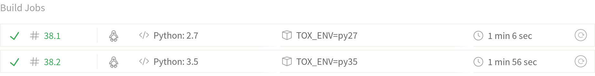

# Testing against multiple python versions with tox

At work, while planning a refactor of one of our applications, we saw that some
of the modules we had in a different project could be reused
for what we needed. I quickly thought, well, I can just move this to
it's own package, add it to both projects as a dependency and the gods of DRY
will be pleased with me.

Later that day, out of the blue, a realization came to me, the project to
refactor is the last one we have that runs on Python 2.7 (I know #SHAME),
while all the other use 3.5. Trying to upgrade the python version is
not an option (hey we still have two years according to the
[pythonclock](https://pythonclock.org/)), so this was the perfect opportunity to
try tox.

From the [official docs](https://tox.readthedocs.io/en/latest/):

> tox is a generic virtualenv management and test command line tool you can use for:
>
> - checking your package installs correctly with different Python versions and interpreters
> - running your tests in each of the environments, configuring your test tool of choice
> - acting as a frontend to Continuous Integration servers, greatly reducing boilerplate and merging CI and shell-based testing.

To start using tox we need to do three things:

1. Install tox with `pip install tox`.
2. Create a setup.py file for our package.
3. Create a tox.ini file at the same directory level than the setup.py file.

## Install
The first step is just executing the `pip install tox` command, you can install
it in it's own virtualenv with the rest of the package requirements.

## setup.py

The next step is to create the setup.py file, ours looks somethings like this:

```
from setuptools import find_packages, setup

setup(
    name='my-tox-tested-package',
    version='0.0.1',
    packages=find_packages(exclude=['tests']),  # Include all the python modules except `tests`.
    description='My custom package tested with tox',
    long_description='A long description of my custom package tested with tox',
    install_requires=[
        'Django>=1.11.0',
        'djangorestframework>=3.6.0',
        # Additional requirements, or parse the requirements file and add it here
    ],
    classifiers=[
        'Programming Language :: Python',
    ],
    entry_points={
        'pytest11': [
            'tox_tested_package = tox_tested_package.fixtures'
        ]
    },
)
```

This is a really simple setup.py file, it defines the package metadata and
it's requirements. This file will let us install our package as a dependency
in other projects, wich we can do locally with `pip install -e <path_to_package>`,
or uploading it to github or [pypi](https://pypi.python.org/pypi) and adding it
to our requirements file. You can find more about packagin in the
[Python Packagin User Guide](https://packaging.python.org/) and in the
[Setuptools documentation](https://setuptools.readthedocs.io/en/latest/index.html).

You may be wondering about the `entry_point` argument passed to the `setup` function,
the entry `pytest11` is used to make
[pytest plugins installable by others](https://docs.pytest.org/en/latest/writing_plugins.html#making-your-plugin-installable-by-others),
in our case it exposes custom pytests fixtures that can be used by projects that install our package.

## tox.ini

Finally, we need to create the tox.ini file, again here's a sample of the one we
use:

```
# tox (https://tox.readthedocs.io/) is a tool for running tests
# in multiple virtualenvs. This configuration file will run the
# test suite on all supported python versions. To use it, "pip install tox"
# and then run "tox" from this directory.

[tox]
envlist = py27, py35

[testenv]
commands =
  pytest {posargs: tests}
  isort --check-only --diff --recursive --skip .tox --skip migrations
  flake8
deps =
  -rrequirements.txt
```

This is a really simple example, the envlist in the tox section specifies that
we want to run the commands of the testenv section against two
versions of python, in this case our targets are 2.7 and 3.5. Tox will work
by creating a separate virtualenv for each version and installing our package
in both of them.

If we want to test only one environment at a time we can pass the `-e` flag
with the name of the environment, for example, to test only python 3.5 we
execute:

```
$ tox -e py35
```

The commands entry in the testenv section defines what tox will execute for
testing our code. The following will be called for each environment:

- pytest for unittest.
- isort for checking imports order.
- flake8 for linting.

One thing to notice is that the pytest command is accompanied by
`{posargs: tests}`, this captures the arguments of the tox command after
`--`, pass them through to pytest and append `tests` to the list of arguments.

A call like:

```
$ tox -- -x
```

Will execute the command:

```
pytest -x tests
```

The last item we have is the deps entry, here are the dependencies of
our project. You can add them one by one, parametrize them according to the
environment, or in our case, install everything that's in the
requirements.txt file.

Whenever we change the project dependencies we have to tell tox to recreate our
environments and install the new dependencies, this is done with the
`--recreate` flag.

```
$ tox --recreate
```

# Pararelizing with travis

To take advantages of the
[Travis CI build matrix](https://docs.travis-ci.com/user/customizing-the-build/#Build-Matrix)
we just have to add the different environments we want to use in the
travis.yml file, this way Travis CI will launch two jobs and execute the tests
for each environment in parallel.

```
language: python
install:
  - pip install tox
matrix:
  include:
    - python: 2.7
      env:
       - TOX_ENV=py27
    - python: 3.5
      env:
        - TOX_ENV=py35
script: tox -e $TOX_ENV
```


**Travis CI execution matrix with two jobs.**

# More complex examples

If your want to check more complex configurations you can take a look in the
[django-braces](https://github.com/brack3t/django-braces/blob/master/tox.ini)
and [pytest-django](https://github.com/pytest-dev/pytest-django/blob/master/tox.ini)
repos, both of them parametrize their environments by python and django
version, among other things.
